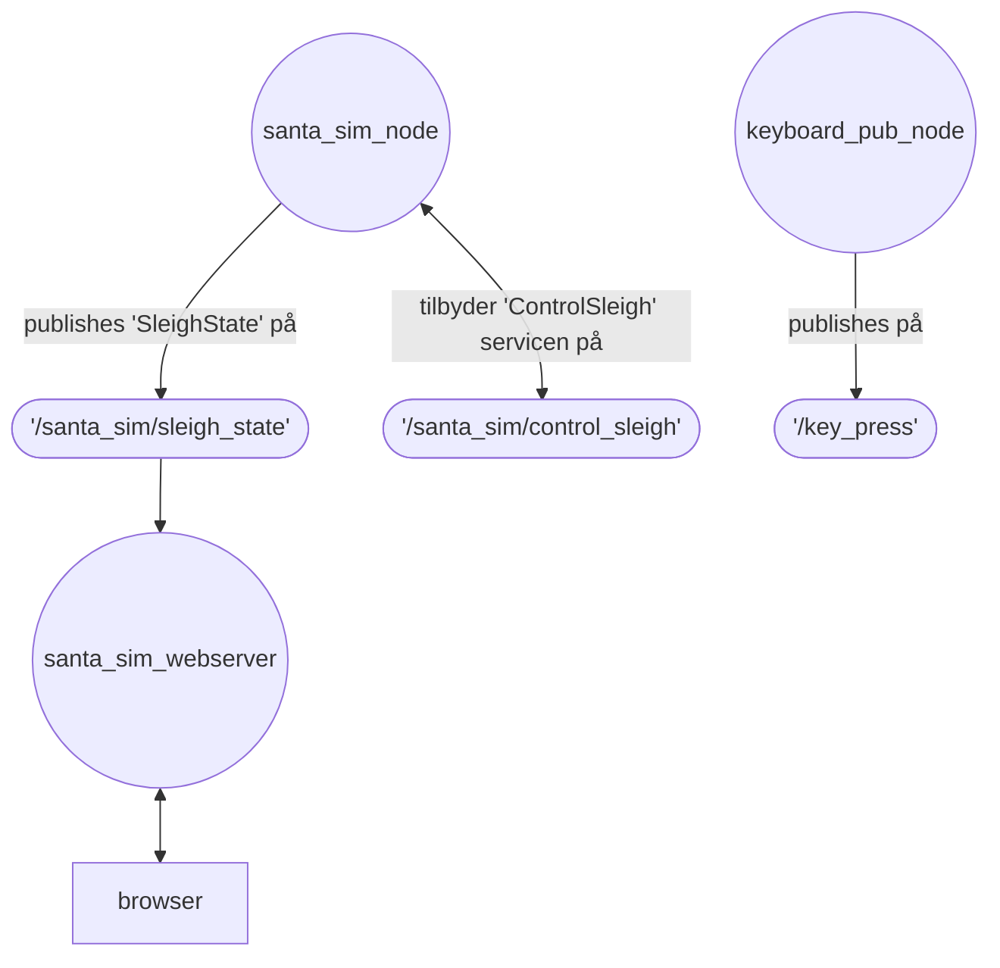
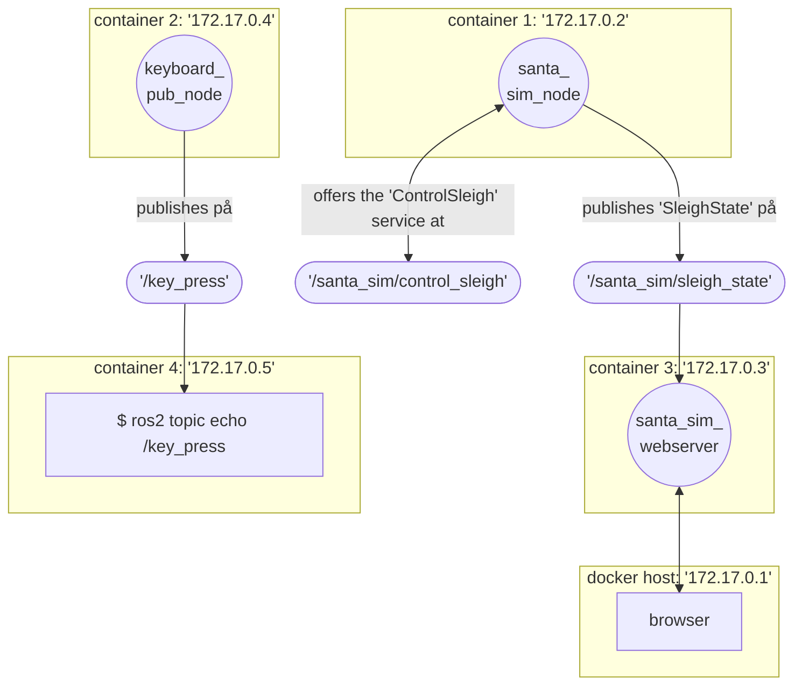
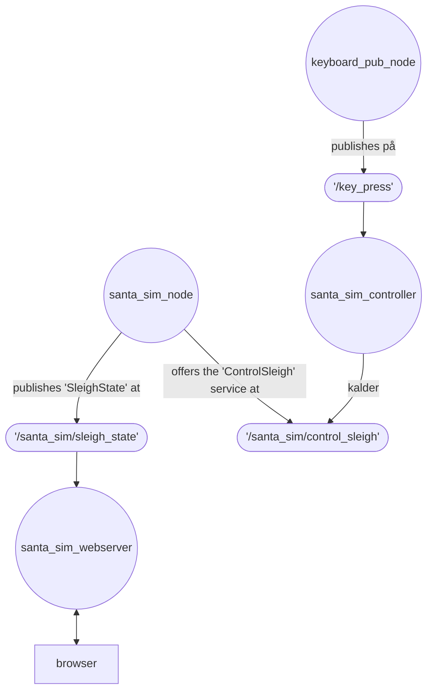

# ROS exercise
Simulation of santa's sleigh in ROS.

The sleigh lives in a 2D world with a position and a velocity.
You can control the sleigh by changing its velocity through a ROS service, and ideally, you would want to control the sleigh with the arrow keys on your keyboard - but that's not quite possible.. yet.

The ROS workspace in it's current state can be visualized as below:

TODO: make sure the diagram follows the same conventions as ROS defaults


> Note: Make sure [Markdown Preview Mermaid Support Extension](https://marketplace.visualstudio.com/items?itemName=bierner.markdown-mermaid) is installed and open the preview in vscode (Markdown Preview from the command pallette).

The ROS workspace consists of four ROS packages:
- [santa_sim_interface](./ros-workspace/src/santa_sim_interface/) defines the santa sleigh messages, including
    - a message [SleighState](./ros-workspace/src/santa_sim_interface/msg/SleighState.msg): 2D position and velocity 
    - and a service [ControlSleigh](./ros-workspace/src/santa_sim_interface/srv/ControlSleigh.srv), which defines the interface to control the sleigh.
    - Note that this package doesn't include an implementation.
        The interface is independent of the implementation and of a programming language.
- [santa_sim](./ros-workspace/src/santa_sim/) contains a node written in c++ which runs the simulation of santa's sleigh and 
    - implements the "ControlSleigh" service interfacet at the topic "/santa_sim/control_sleigh",
    - and publishes the sleigh state ("SleighState") on the topic "/santa_sim/sleigh_state". 
- [santa_sim_webserver](./ros-workspace/src/santa_sim_webserver/) contains a node written in python with flask + html/css/javascript. The node subscribes to "santa_sim/sleigh_state" and runs a webserver with a visualization of santa's sleigh.
- [keyboard_pub_pkg](./ros-workspace/src/santa_sim_webserver/) contains a node written in python which captures keyboard input and publishes them on the topic "/key_press". 

Now, for the application to work as intended, we need a node which connects "/key_press" to "/santa_sim/control_sleigh" - but we'll come back to that.
Let's first look at what we have:


## Build docker image
The Dockerfile describes the whole pipelinen for building the [workspace](./ros-workspace/).

The Dockerfile
- is based on an officiel ROS image w/ Ubuntu 22,
- installs dependencies,
- copies the source code from "/ros-workspace" to the container,
- and builds the workspacet with ROS' build tool, [colcon](https://docs.ros.org/en/jazzy/Tutorials/Beginner-Client-Libraries/Colcon-Tutorial.html).

Read through the [Dockerfile](./Dockerfile).

Then, build the container:
```bash
$ docker build -t rosapp .
```

> Note that ROS and containers has nothing to do with each other. We just use containers
> to help with isolation and dependency management. Environment compatibilities are the
> source of so much debugging - containers helps keep our sanity. Thanks containers.

## A short container recap
Remember that containers are comparable with virtual machines.
We can both start a terminal in a container (Term, C1, below) and in the host (your main OS):
```
| Term | ...
|  C1  | C2 | ... |
|  Docker Engine  |   Term   |  Browser |
| Host OS (f.eks. Windows elller Linux) |
|               Hardware                |
```
- All "$ docker [...]$ commands run on your host to administrate the containers.
- In the Dockerfile, we start from an image, where ROS is installed, which is why we can use ROS commands *inside* the container. However, unless you install ROS on your host OS, you can't run ROS commands in a host terminal.

## Run containers
Create and start a container of the image "rosapp" you built:
```bash
$ docker run --rm -it rosapp
# --rm: remove container after container exits
# -i: interactive (will bind stdin to your terminal)
# -t: tty: more terminal features
# -it: interactive + tty
```

Your terminal will be attached to the container, so you can type in commands in the container. Try `$ ls` to convince yourself that you are attached to the container.

Press `ctrl + d` to detach from the container (removing the container since we added `--rm`).

We can also run a command as we start the container:
```bash
$ docker run --rm -it rosapp [CMD]
```

List all installed ROS packages:
(our packages should be there):
```bash
$ docker run --rm -it rosapp ros2 pkg list
```

We can also list all nodes, we can run:
(our nodes should be there):
```bash
$ docker run --rm -it rosapp ros2 pkg executables
```

## Run the keyboard node

In one terminal, run the keyboard publisher node:
```bash
$ docker run --rm -it rosapp ros2 run keyboard_pub_pkg keyboard_pub_node
```
and see, that when you press a key (while the terminal is active), then it logs that you've published that key press.

In another terminal, list current topics
("/key_press" should be there):
```bash
$ docker run --rm rosapp ros2 topic list
```

Try subscribing to the topic from the terminal
```bash
$ docker run --rm -it rosapp ros2 topic echo /key_press
```
and go back to the first terminal and press a few keys.
The keys should be printed in the second terminal.

## No broker?
ROS does some magic to establish connections between nodes on a network based on the topics. It's outside the scope for this course.

## Network diagram
An example of how it might look if the three nodes were run in each their container and you're running the "echo" command from above.




## Santa sim node

Try running our santa simulator:
(terminal A)
```bash
$ docker run --rm -it rosapp ros2 run santa_sim santa_sim_node
```

And see that the sleigh is not moving:
(terminal B)
```bash 
$ docker run --rm -it rosapp ros2 topic echo /santa_sim/sleigh_state
```

Giv the sleigh a push:
(terminal C)
```bash 
$ docker run --rm rosapp ros2 service call /santa_sim/control_sleigh santa_sim_interface/srv/ControlSleigh "{delta_speed_x: 1., delta_speed_y: 0.}"
```

## Webserver
```bash
$ docker run --rm -it -p 8080:5000 rosapp ros2 run santa_sim_webserver santa_sim_webserver
```
Run the above.
The webserver is hosted in port 5000 in the container. In the command above, we map port 8080 on the docker host (your main os) to port 5000 in the container, so you can open [localhost:8080](http://localhost:8080/) in a browser.

Alternatively, you could also use `$ docker ps` and `$ docker network inspect bridge` to find the ip of the webserver container and open `[ip]:5000` in your browser.

The webserver serves an html file on the root url "/" and a json api on "/get_state.json".
In your browser, javascript code from the html-file *polls* the get_state api to update the visualization.

## Exercises:

First some notes: 

> Note 1: This folder contains a git repo. It can be a good idea to commit as you get stuff working, so you can go back to a working state, in case something is suddenly not working - again, we like to keep our sanity!

> Note 2: Setting up your developing environment so you get meaningful autocompletion and linting is possible but beyond this lecture.

> Note 3: The packages have boilerplate (code which has to be there but is not contributing to the logic of the application). For example an almost empty resource folder which has to be there, package.xml and some setup files. You can just ignore them for now.

### Main exercise

Make a new package, `santa_keyboard_controller`, with a node which listens for the key presses on the `/key_press` topic and calls the service `/santa_sim/control_sleigh`. (See a diagram of the intended configuration below).

1) Don't change the packages *santa_sim* or *keyboard_pub_pkg*.
2) Start by making a copy of the *keyboard_pub_pkg* folder and change the name in the copy to *santa_keyboard_controller*. (note that there are a few files where the name has to be changed. Try searching for the name in the whole folder)
3) Uncomment the lines (Remove "#") in the Dockerfile which copies and builds the new package. Remember to rebuild and restart affected containers after changing code.
4) Start by subscribing to `/key_press` with a callback which prints the key in your terminal and make sure that works.
You can get inspiration from the official [subcriber example](https://docs.ros.org/en/jazzy/Tutorials/Beginner-Client-Libraries/Writing-A-Simple-Py-Publisher-And-Subscriber.html#id1)
5) When that works, change your callback so that it calls the service `/santa_sim/control_sleighn` with a fitting request, so you can control the sleigh with your key arrow presses from the keyboard_pub_node terminal.
You can get some inspiration from the official [service client example](https://docs.ros.org/en/jazzy/Tutorials/Beginner-Client-Libraries/Writing-A-Simple-Py-Service-And-Client.html#write-the-client-node).
6) Now, you should be able to run the nodes below in each their terminal, see the sleigh in [localhost:8080](http://localhost:8080/) and control the sleigh with arrow key presses from the *keyboard_pub_node*.
    ```bash
    $ docker run --rm -it rosapp ros2 run keyboard_pub_pkg keyboard_pub_node
    $ docker run --rm -it rosapp ros2 run santa_sim santa_sim_node
    $ docker run --rm -it -p 8080:5000 rosapp ros2 run santa_sim_webserver santa_sim_webserver
    $ docker run --rm -it rosapp ros2 run santa_keyboard_controller santa_keyboard_controller
    ```
    If you get in doubt whether there are containers running in the background, use `$ docker ps` to see them and `$ docker kill` to stop them.


Desired configuration:



### Bonus exercises
1) Make a python-implementation of the *santa_sim* package: *santa_sim_py*. It should replace the *santa_sim* exactly - that is - without requiring *any* changes in *any* of the existing packages.
2) Make a c++ implementation of the *santa_keyboard_controller*. 